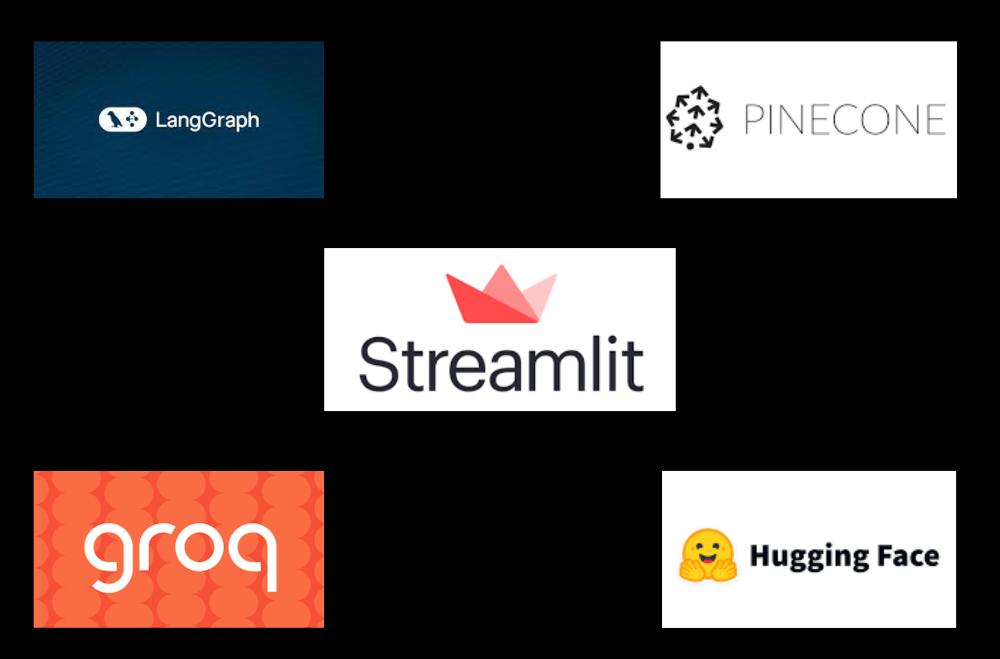

# RAG Application using Streamlit

## Overview
This project is a Retrieval-Augmented Generation (RAG) application built using Streamlit. It integrates LangChain, Pinecone, LangGraph, and other tools to provide efficient retrieval and generation of text responses using an LLM. The current implementation utilizes the **DeepSeek** model for language processing.

## Images
Below are images representing key technologies used in this project:



## Features
- **Document Processing:** Load and process PDFs using LangChain's document loaders.
- **Chunking Mechanism:** Splits documents into smaller, manageable chunks using recursive text splitting.
- **Embedding & Vector Storage:** Uses HuggingFace embeddings and stores vectors in Pinecone.
- **Query Processing:** Retrieves relevant chunks and generates responses based on retrieved information.
- **Graph-based Execution:** Uses LangGraph to manage conversation flow.
- **Streamlit UI:** Provides an interactive interface for users to upload documents and query them.

## Technologies Used
- **[LangChain](https://github.com/hwchase17/langchain) & LangChain Community Modules** – For integrating various AI components.
- **[Pinecone](https://www.pinecone.io/)** – For vector database storage and retrieval.
- **[LangGraph](https://github.com/langchain-ai/langgraph)** – For defining and managing multi-step workflows.
- **[Streamlit](https://streamlit.io/)** – For building an interactive UI.
- **[DeepSeek Model](https://huggingface.co/deepseek-ai)** – The current LLM powering the system.

## Setup & Installation
1. Clone the repository:
   ```bash
   git clone https://github.com/Siba4442/Rag-application-using-streamlit.git
   ```
2. Navigate to the project directory:
   ```bash
   cd Rag-application-using-streamlit
   ```
3. Create and activate a virtual environment:
   ```bash
   python -m venv venv
   source venv/bin/activate  # On Windows: venv\Scripts\activate
   ```
4. Install dependencies:
   ```bash
   pip install -r requirements.txt
   ```
5. Run the Streamlit application:
   ```bash
   streamlit run app_V1.py
   ```

## Future Improvements
- **Advanced Chunking Insights:** Provide options to visualize which chunks are extracted.
- **Better Pinecone Management:** Optimize indexing, retrieval, and vector storage.
- **Graph Structure Enhancements:** Improve the workflow logic within LangGraph.
- **Configurable Chunk Retrieval:** Allow users to customize the number of retrieved chunks.
- **Metadata Extraction Improvements:** Enhance the quality and structure of extracted metadata.
- **Support for More LLMs:** Add options to integrate various large language models beyond DeepSeek.
- **Multiple Database Support:** Enable compatibility with vector databases other than Pinecone.


---

